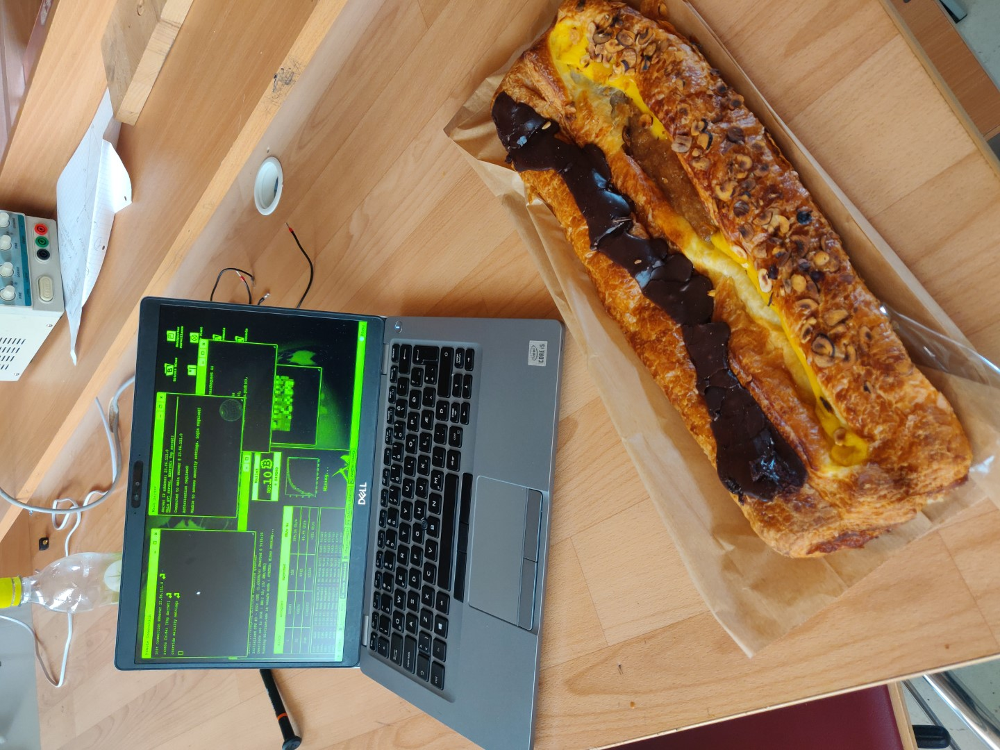
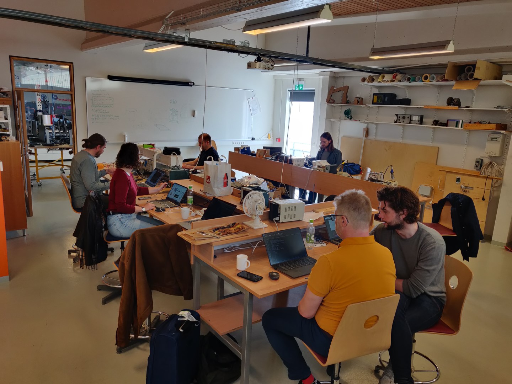

# FLI-Boot-Camp-2023

Inni í þessu gagnasafni geymum við gögn úr Boot Camp Neskaupstað 2023.

**Við viljum fá valdar myndir inn, notið img möppuna**

**Jón Þór ætlar að búa til CNC listaverk sem nær utan um ráðstefnuna.**

## Punktar af töflu - TODO: Skjala hvert og eitt
- [x] Skjölun með git á Github
  - Koma sem flestum inn á git
  - Almennar git æfingar
  - Organization
- [ ] Bjórdælustandur
- [ ] Stöplar undir listaverk
- [ ] Jesmonite afsteypun
- [x] ESP32/RP2040 yfirferð
  - [x] FABXIAO 
  - [x] FMCU

Komin inn á FMCU: 
- [x] Akureyri
- [ ] Austurland
- [ ] Blönduós
- [ ] Húsavík
- [ ] Höfn í Hornafirði
- [ ] Ísafjörður
- [ ] Reykjavík
- [x] Sauðárkrókur
- [x] Selfoss
- [ ] Strandir
- [ ] Vestmannaeyjar
- [ ] Rafrásafræsun
  - KiCAD
  - FlatCAM Tool Database
  - Laga rafrásafræsinn
- [ ] FAB academy
  - Modular things
  - Beehive
  - Aðstoð/vinnstofur með nemendum

## Git - Skjölun, skráningar og æfingar

Yfir kaffi og góðu vínarbrauði frá Nesbæ var hópnum komið í betra samband við Git/Github. 

Smiðjustjórum var kennt hvernig *Orginization* getur nýst hverri smiðju fyrir sig, þeir sem það kusu stofnuðu sín eigin og *fork*uðu [FMCU](https://github.com/Fab-Lab-Akureyri/fla-fmcu/) útgáfu [FLA](http://fla.is/) til að prófa sig áfram.

Einnig var sýnt hvernig git nýtist sem útgáfustjórnun og skipulagstól og lagt er upp með að Fab Lab Ísland hópurinn tileinki sér notkun tólsins til að halda utan um sín tækinlegu verkefni, á meðan þau eru í þróun, til að deila þeim og auka sýnileika á þeim. 
